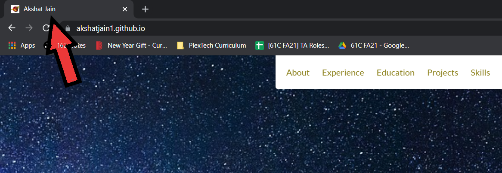

# Resume Website

## Intro

A *resume* is a document that you submit to potential employers. It is a summary of your achievements and qualifications. Since most job searches are performed over the internet, resumes are often presented in electronic format.

For this assignment you will create an online resume using your knowledge of `HTML` and `CSS`. This will contain your name and picture, your contact information, education, employment history and much more! The best thing about this assignment is that it's all customizable!

## How to create an effective resume [Optional]

A resume is an *essential* document for finding employment. It is a summary of your accomplishments, achievements, and experience. It also gives potential employers a sense of who you are and what skills and talents you possess.

Because of the impact of the internet on employment and job searches, more and more resumes are being published in electronic format. This assignment will result in an electronic version of your resume.

Before you start coding your resume, you need to plan and structure what you are going to include. Resumes contain contact information, a description of what type of job you are looking for, a summary of your work and education experience, and other relevant information like personal interests or volunteer activities. Look at examples of resumes, and use them as a model for your own online resume. Make a list of your work experience, along with information about your educational background and achievements. 

### 5 Key Concepts for Powerful, Effective Resumes

1.	Your resume is **YOUR** marketing tool, not a personnel document.

2.	It is about YOU the job hunter, not just about the jobs you've held.

3.	It focuses on your future, not your past.

4.	It emphasizes your accomplishments, not your past job duties or job descriptions.

5.	It documents skills you enjoy using, not skills you used just because you had to.

### 10 Steps in Creating a Good Resume

1.	Choose a target job (also called a *job objective*). An actual job title works best.

2.	Find out what skills, knowledge, and experience are needed to do that target job.

3.	Make a list of your 2, 3, or 4 strongest skills or abilities or knowledge that make you a good candidate for the target job.

4.	For each key skill, think of several accomplishments from your past work history that illustrate that skill.

5.	Describe each accomplishment in a simple, powerful, action statement that emphasizes the results that benefited your employer.

6.	Make a list of the primary jobs you've held, in chronological order. Include any unpaid work that fills a gap or that shows you have the skills for the job.

7.	Make a list of your training and education that's related to the new job you want.

8.	Choose a resume format that fits your situation--either chronological or functional. [Functional works best if you're changing fields; chronological works well if you're moving up in the same field.]

9.	Arrange your action statements according to the format you choose.

10.	Summarize your key points in your job objective

## A Note on Collaboration

Even though this is a *personal* project in the sense that a resume website is highly personal to you, you should be interacting with your team members as if this was a group project. Exchange ideas, Discuss solutions, help your group members. Don't let anyone feel left out.. Remember, you're all in this together! 

Additionally, just as much as your teammates, online resources will be your best friend.

## Setup

Assuming you've already clone your personal repository and added the `fa21-plextech-fswd` remote..

1. Pull the starter code
    - `git pull starter main`

2. Push to your Github
    - `git add .`
    - `git commit -m "Added starter code for Resume Website"`
    - `git push origin main`

## Task 1 - Fill Your Content

### Task 1.1

Many websites have a page description at the top of every page you visit. For example,

How can you add this to your website? Open the `index.html` file in your browser to verify your changes!

### Task 1.2

Time to tell employers a quick summary about you!

Include:

- Your name *e.g. Bob Builder*
- Job title or tagline *e.g. Software Engineer*
- Job Objective *e.g. Bob the Builder Can we fix it? Bob the Builder Yes, we can! Scoop, Muck and Dizzy, and Rolly too Lofty and Wendy join the crew*

Think about what HTML tags would be appropriate for each piece of content. Remember, you're not adding any styling yet!

## Contributions

Thank you to:
- Akshat Jain (PlexTech)
- Christina Truong for providing Starter Code
- Pace University's CIS 101 for the Resume Tips

